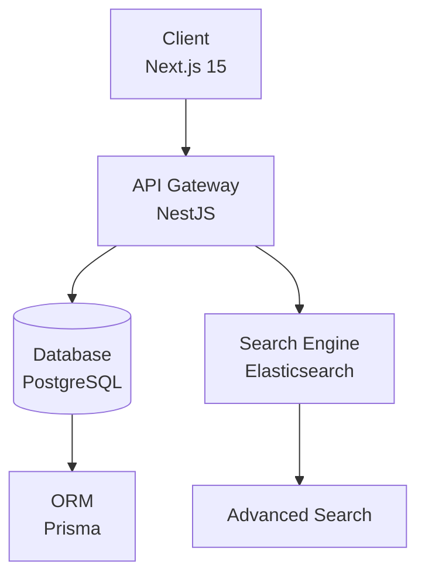

# 🛍️ BackMarket‑style E‑commerce

<p>
  
  
  
</p>
  <a href="https://nextjs.org/"></a>
  <a href="https://nestjs.com/"></a>
  <a href="https://www.typescriptlang.org/"></a>
  <a href="https://prisma.io/"></a>
  <a href="https://postgresql.org/"></a>
  <a href="https://neon.tech/"></a>
  <a href="https://docker.com/"></a>
  <a href="https://tailwindcss.com/"></a>
  <a href="https://www.elastic.co/"></a>
  <a href="https://ui.shadcn.com/"></a>
  <a href="https://github.com/features/copilot"></a>
  <a href="https://www.atlassian.com/software/jira"></a>
  <a href="https://coderabbit.ai"></a>
  <a href="LICENSE"></a>


## 📋 Navigation

- 📖 [A. Overview](#a-overview)
- ✨ [B. Goals & Key Features](#b-goals--key-features)
- 🏗️ [C. Project Structure](#c-project-structure)
- 📋 [D. System Requirements](#d-system-requirements)
- 🚀 [E. Quick Start](#e-quick-start)
- 🛠️ [F. Tech Stack](#f-tech-stack)
- 🚀 [G. Production Deployment](#g-production-deployment)
- ⚙️ [H. Quality & CI/CD](#h-quality--cicd)
- 👥 [I. Core Team](#i-core-team)

## 📖 A. Overview

<div align="center">
  
</div>

<br/>

🎯 **A modern e-commerce platform inspired by Back Market** - A comprehensive marketplace solution for refurbished electronics and pre-owned gadgets, designed to provide users with a reliable, affordable, and trustworthy platform for buying and selling certified second-hand devices.

## ✨ B. Goals & Key Features

<table>
  <tr>
    <td align="center" width="100%">
      <h3>🔍 Smart Search</h3>
      <p>Advanced search with Elasticsearch algorithm and multi-filter options</p>
    </td>
  </tr>
  <tr>
    <td align="center" width="100%">
      <h3>⚡ Fast Performance</h3>
      <p>Optimized for speed with modern tech stack and efficient data handling</p>
    </td>
  </tr>
  <tr>
    <td align="center" width="100%">
      <h3>🎨 Modern UI/UX</h3>
      <p>Clean, professional interface with seamless user experience</p>
    </td>
  </tr>
  <tr>
    <td align="center" width="100%">
      <h3>🔧 Complex Management</h3>
      <p>Sophisticated product variant and pricing management system</p>
    </td>
  </tr>
</table>

### 🚀 Key Capabilities

- **🔍 Flexible Product Selection**: Detailed and flexible product type selection with specific variations
- **⚡ Advanced Search & Filtering**: Fast, accurate search with combination filters (condition, storage, color, carrier, battery health...)
- **⚙️ Complex Product Management**: Intricate product variants and attributes with dynamic pricing
- **🎨 Modern & User-Friendly Interface**: Clean, professional UI for seamless experience across all devices
- **🔐 Secure Authentication**: JWT-based auth with OAuth2 integration (Facebook & Google)
- **📊 Data Analytics**: Comprehensive analytics and reporting capabilities

## 🏗️ C. Project Structure

```
back-market/
├── 📁 client/                 # Frontend Application (Next.js 15)
│   ├── 📁 src/
│   │   ├── 📁 app/           # Next.js App Router
│   │   ├── 📁 components/    # Reusable UI Components
│   │   ├── 📁 hooks/         # Custom React Hooks
│   │   └── 📁 libs/          # Utility Libraries
│   └── 📄 package.json
│
├── 📁 server/                 # Backend Application (NestJS)
│   ├── 📁 src/
│   │   ├── 📁 auth/          # Authentication Module
│   │   ├── 📁 prisma/        # Database Schema & Config
│   │   └── 📁 product/       # Product Management
│   ├── 📁 prisma/            # Prisma Schema & Migrations
│   └── 📄 package.json
│
└── 📄 README.md              # Project Documentation
```

### 📊 Data Flow Architecture

<div align="center">



</div>

## 📋 D. System Requirements

| Component | Version | Notes |
|-----------|---------|-------|
| **Node.js** | ≥ 22.0.0 | Required for both client and server |
| **Yarn** | ≥ 1.22.0 | Recommended package manager |
| **PostgreSQL** | Latest | Hosted on Neon Cloud |
| **Docker** | Latest | For containerized development |

## 🚀 E. Quick Start

### ⚡ One-Command Setup

```bash
git clone https://github.com/mrthinh307/back-market.git
cd back-market
yarn install && yarn dev
```

### 📊 Detailed Setup

#### 1. 📥 Clone & Install
```bash
git clone https://github.com/mrthinh307/back-market.git
cd back-market
corepack enable
yarn install
```

#### 2. 🔧 Environment Setup
```bash
# Copy environment files
cp client/.env.example client/.env.local
cp server/.env.example server/.env
```

#### 3. 🐳 Docker Development
```bash
# Start development stack
yarn docker:up
```

#### 4. 🗄️ Database Setup
```bash
cd server
npx prisma generate
npx prisma db push
```

#### 5. ▶️ Run Applications

**Terminal A - Backend:**
```bash
cd server
yarn dev
```
📍 **Server**: `http://localhost:8888`

**Terminal B - Frontend:**
```bash
cd client
yarn dev
```
📍 **Client**: `http://localhost:3000`

## 🛠️ F. Tech Stack

### 🖥️ Backend (Server)

| Technology | Purpose | Details |
|------------|---------|---------|
| **NestJS** | Framework | Progressive Node.js framework |
| **TypeScript** | Language | Type-safe JavaScript |
| **Prisma** | ORM | Next-gen database toolkit |
| **PostgreSQL** | Database | Robust relational database |
| **JWT** | Authentication | Secure token-based auth |
| **Elasticsearch** | Search | Advanced search capabilities |
| **Jest** | Testing | Comprehensive API testing |

### 💻 Frontend (Client)

| Technology | Purpose | Details |
|------------|---------|---------|
| **Next.js 15** | Framework | React framework with App Router |
| **TypeScript** | Language | Type-safe development |
| **Tailwind CSS 4** | Styling | Utility-first CSS framework |
| **shadcn/ui** | Components | Modern UI component library |
| **Vitest** | Testing | Fast unit testing |
| **Playwright** | E2E Testing | Cross-browser testing |

## 🚀 G. Production Deployment

### Backend Deployment

```bash
cd server
yarn build
yarn start:prod
```

### Frontend Deployment

```bash
cd client
yarn build
yarn start
```

### Docker Deployment

```bash
# Build and run production containers
docker-compose -f docker-compose.prod.yml up -d
```

## ⚙️ H. Quality & CI/CD

### 🛠️ Development Tools

- **🧹 Code Quality**: ESLint, Prettier, TypeScript strict mode
- **📝 Commit Standards**: Conventional commits with Commitlint
- **🔧 Automation**: Lefthook for pre-commit hooks
- **🤖 Code Review**: CodeRabbit AI-powered reviews
- **💡 Collaboration**: GitHub Actions, CODEOWNERS, Dependabot

### 🔄 CI/CD Pipeline

```mermaid
flowchart LR
    A[Developer<br/>Commit] --> B[Lefthook<br/>Pre-commit]
    B --> C[Commitlint<br/>Message Check]
    C --> D[Push to<br/>GitHub]
    
    D --> E[GitHub Actions<br/>CI Pipeline]
    E --> F[CodeRabbit<br/>AI Review]
    
    F --> G[PR Approved<br/>≥2 Reviewers]
    G --> H[Squash & Merge<br/>to main]
    H --> I[Auto Deploy<br/>Production]
    
    J[Code Quality<br/>ESLint/Prettier] --> E
    K[Testing<br/>Jest/Vitest] --> E
    L[Security<br/>Dependabot] --> E
```

<div align="center">



</div>

## 👥 I. Core Team

<div align="center">
  <h3>🌟 Meet Our Amazing Team</h3>
  <p><em>Passionate developers building the future of e-commerce</em></p>
</div>

<div align="center">

<table>
  <tr>
    <td align="center">
      <a href="https://github.com/mrthinh307">
        <br />
        <b>Duy Thinh</b><br />
        <em>PM & Fullstack Developer</em>
      </a>
    </td>
    <td align="center">
      <a href="https://github.com/Hiisam17">
        <br />
        <b>Khanh Toan</b><br />
        <em>Frontend Developer</em>
      </a>
    </td>
    <td align="center">
      <a href="https://github.com/mingg23805">
        <br />
        <b>Ngoc Minh</b><br />
        <em>Data Engineer</em>
      </a>
    </td>
  </tr>
  <tr>
    <td align="center">
      <a href="https://github.com/mtuong1031">
        <br />
        <b>Minh Tuong</b><br />
        <em>Frontend Developer</em>
      </a>
    </td>
    <td align="center">
      <a href="https://github.com/thinh2711">
        <br />
        <b>Xuan Thinh</b><br />
        <em>Frontend Developer</em>
      </a>
    </td>
    <td align="center">
      <a href="https://github.com/crisaq2410">
        <br />
        <b>Anh Quoc</b><br />
        <em>Backend Developer</em>
      </a>
    </td>
  </tr>
</table>

</div>

---

<div align="center">
  <p><strong>💡 Made with ❤️ by our team</strong></p>
  <p>
    <a href="#-backmarketstyle-ecommerce">⬆️ Back to Top</a> •
    <a href="https://github.com/mrthinh307/back-market/issues">🐛 Report Bug</a> •
    <a href="https://github.com/mrthinh307/back-market/pulls">✨ Request Feature</a>
  </p>
</div>
